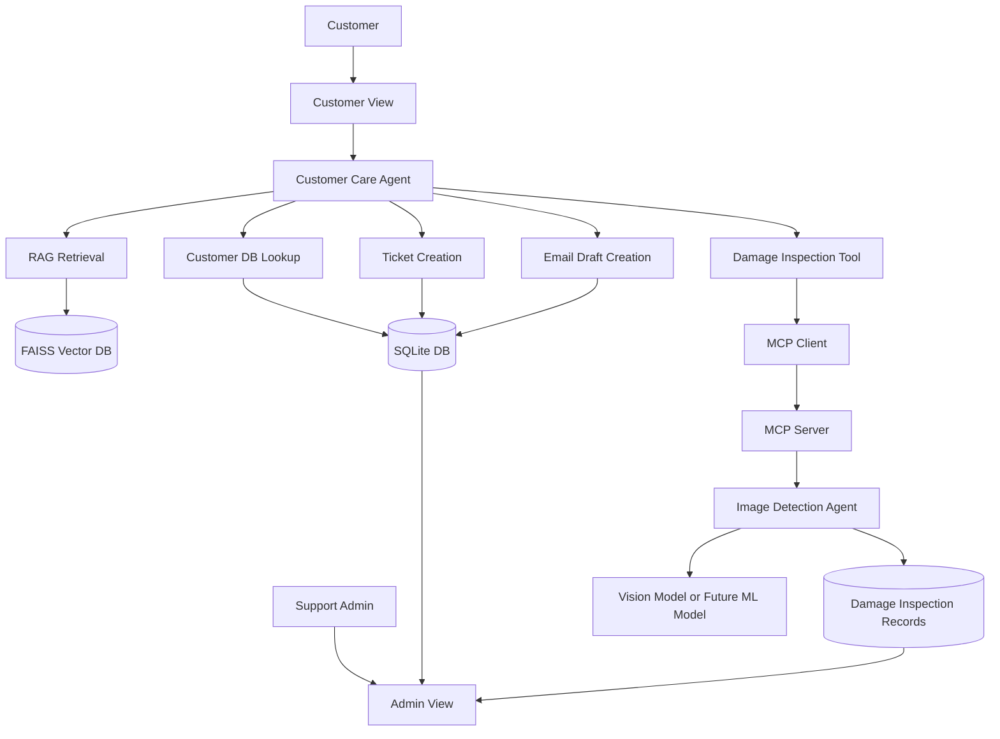
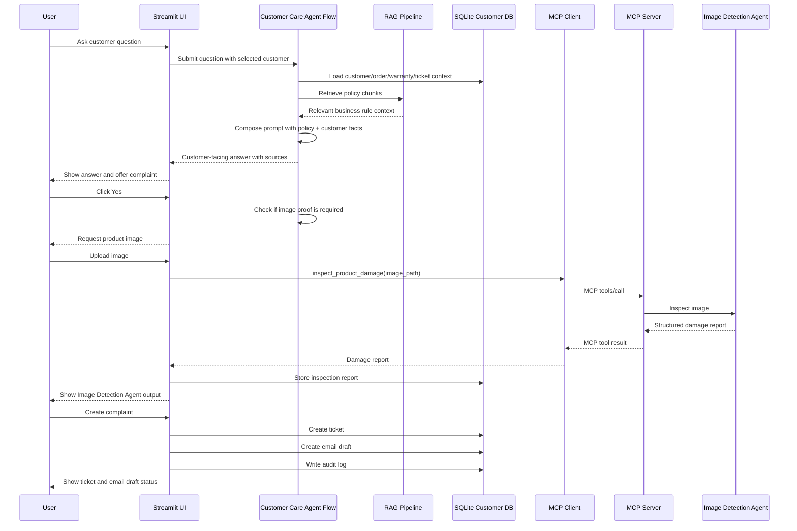

# Component and Agent Integration

This document explains how LexiFlow components interact during a customer-care
case. The project currently uses logical agents inside one app, with the image
inspection capability exposed through MCP.

## Logical Component Diagram



## Main Interaction Sequence



## Agent Responsibilities

### Customer Care Agent

The Customer Care Agent is responsible for business conversation and support
decisioning.

Inputs:

- customer question,
- retrieved business policy chunks,
- customer/order/warranty context,
- existing ticket context,
- image inspection report when available.

Outputs:

- customer-facing answer,
- complaint recommendation,
- image upload request,
- ticket creation trigger,
- email draft trigger.

The agent does not directly inspect images. It asks the Image Detection Agent
for image evidence through the MCP tool.

### Image Detection Agent

The Image Detection Agent is responsible for product image inspection.

Inputs:

- uploaded image path,
- optional image URL,
- optional order ID.

Outputs:

```json
{
  "inspection_status": "completed",
  "damage_detected": true,
  "damage_type": "possible_visible_damage",
  "severity": "medium",
  "confidence": 0.76,
  "needs_human_review": true,
  "recommendation": "eligible_for_complaint_review",
  "image_url": "uploads/ORD-1001_photo.png",
  "notes": "Inspection notes",
  "source": "openai_vision",
  "model": "gpt-4.1-mini"
}
```

The current implementation can use OpenAI vision or a mock fallback. The future
implementation can call the trained product damage ML project while preserving
the same output schema.

### Admin View

Admin View is not an agent. It is the operational console for reviewing what
the agents did.

It shows:

- dashboard metrics,
- ticket records,
- email drafts,
- audit logs,
- damage inspection records,
- document/source search tools.

## Why MCP Is Used Only for Damage Detection

MCP is intentionally limited to the image inspection use case for learning
clarity.

This keeps the demo explanation clean:

```text
The Customer Care Agent needs a specialist capability.
It calls the Damage Detection Agent through MCP.
The Damage Detection Agent returns structured evidence.
The Customer Care Agent uses that evidence to continue the complaint flow.
```

Tickets and email drafts remain direct local functions because the current demo
does not need to expose them to external agent clients yet.

## Future Multi-Agent Split

If the project grows, these logical components can become separate services:

| Future Service | Responsibility |
|---|---|
| Customer Agent Service | Conversation, eligibility, customer support reasoning |
| RAG Service | Document ingestion and retrieval |
| Customer Data Service | Secure access to customer/order records |
| Damage Detection Service | Model inference for product damage |
| Tool Gateway/MCP Server | Standardized tool access |
| Ticketing Integration Service | CRM/ticket creation |
| Notification Service | Email/SMS/WhatsApp actions |

The current code is a learning-friendly version of that architecture.
