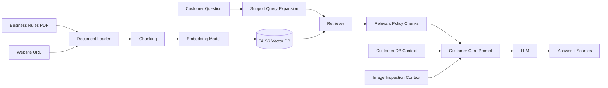
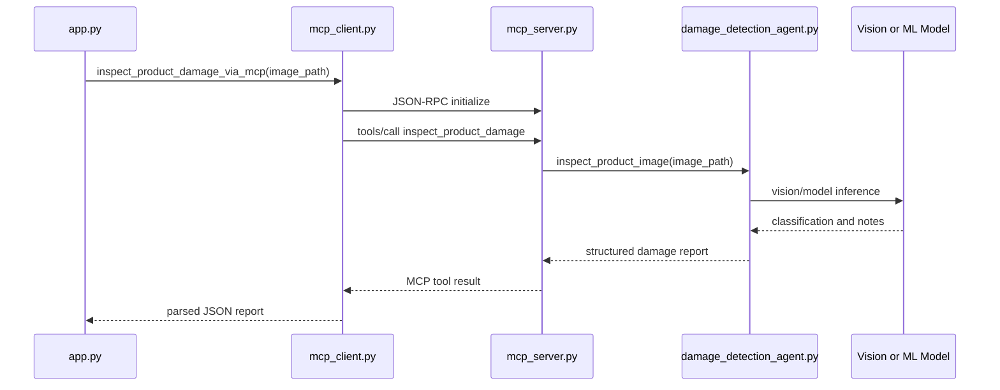

# How RAG and MCP Are Used in LexiFlow

This document explains the two most important AI architecture concepts in the
project: RAG and MCP.

## 1. Why RAG Is Used

Large language models can answer fluently, but they do not automatically know a
company's latest policies, refund rules, warranty rules, or escalation process.
RAG solves this by retrieving the relevant company knowledge before the LLM
answers.

In LexiFlow, RAG is used to ground support answers in uploaded business rules
documents.

## 2. RAG Flow in This Project



## 3. RAG Implementation Details

Main file:

```text
rag_pipeline.py
```

Key implementation steps:

1. `load_pdf()` loads PDF pages.
2. `load_website()` loads website content.
3. `split_documents()` chunks the content.
4. `create_vector_db()` creates the FAISS index.
5. `similarity_search()` retrieves matching chunks.
6. `query()` builds the prompt and calls the LLM.

Important design choices:

- Documents are chunked with overlap to preserve context.
- FAISS is used for fast local semantic search.
- Source chunks are returned and displayed below answers.
- Support query expansion improves retrieval for refund, warranty,
  replacement, technical, delivery, billing, and escalation questions.
- Priority matching helps exact policy chunks appear before general semantic
  matches.

## 4. RAG Inputs and Outputs

Inputs:

- uploaded business rules PDFs,
- optional website content,
- customer question,
- selected customer/order context,
- optional image inspection report.

Outputs:

- customer-facing answer,
- retrieved source chunks,
- source metadata such as document name and page.

Example answer behavior:

```text
Question: Can I get a refund after 20 days?

RAG retrieves: refund policy and return window rules.
Customer DB provides: delivery date and days since delivery.
LLM answers: eligibility based on both policy and customer facts.
```

## 5. Why MCP Is Used

MCP, or Model Context Protocol, provides a standard way for AI applications to
call external tools.

In LexiFlow, MCP is used for one focused purpose:

```text
Damage inspection of uploaded product images.
```

This lets the Customer Care Agent call a specialist Image Detection Agent
without tightly coupling the app to that implementation.

## 6. MCP Flow in This Project



## 7. MCP Server

Main file:

```text
mcp_server.py
```

Current MCP tool:

```text
inspect_product_damage
```

Input schema:

```json
{
  "image_path": "uploads/ORD-1001_photo.png",
  "image_url": "uploads/ORD-1001_photo.png",
  "order_id": "ORD-1001"
}
```

Output:

```json
{
  "inspection_status": "completed",
  "damage_detected": true,
  "damage_type": "possible_visible_damage",
  "severity": "medium",
  "confidence": 0.76,
  "needs_human_review": true,
  "recommendation": "eligible_for_complaint_review",
  "image_url": "uploads/ORD-1001_photo.png",
  "notes": "Inspection notes",
  "source": "openai_vision",
  "model": "gpt-4.1-mini"
}
```

## 8. MCP Client

Main file:

```text
mcp_client.py
```

The client:

1. Starts `mcp_server.py` as a local subprocess.
2. Sends JSON-RPC messages over stdin/stdout.
3. Calls `tools/call`.
4. Parses the returned JSON report.
5. Closes the MCP server process.

The Streamlit app calls:

```python
inspect_product_damage_via_mcp(
    image_path=image_path,
    image_url=image_path,
    order_id=case["order_id"],
)
```

## 9. RAG vs MCP

| Concept | Used For | Example in LexiFlow |
|---|---|---|
| RAG | Retrieve knowledge before answering | Refund policy, warranty rules, escalation rules |
| MCP | Call a tool or external capability | Inspect uploaded product image |

Simple explanation:

```text
RAG gives the agent knowledge.
MCP gives the agent tools.
```

## 10. Why Not Put Everything in MCP?

For learning clarity, only damage inspection is exposed through MCP.

Customer lookup, ticket creation, email draft creation, and audit logging remain
local app functions. They can be converted to MCP tools later, but doing that
now would make the learning story harder to explain.

The current design is intentionally simple:

```text
RAG = business rules knowledge
SQLite = customer/order facts
MCP = specialist image inspection tool
Actions = local ticket/email functions
```

## 11. Future ML Integration

When the trained product damage ML project is available, integrate it behind
the same MCP interface.

Recommended approach:

1. Keep `inspect_product_damage` as the MCP tool name.
2. Keep the same JSON output schema.
3. Update `damage_detection_agent.py` to call the trained model.
4. Leave `app.py`, `mcp_client.py`, and dashboard logic mostly unchanged.

This makes the ML model a drop-in replacement for the current OpenAI
vision/mock implementation.
