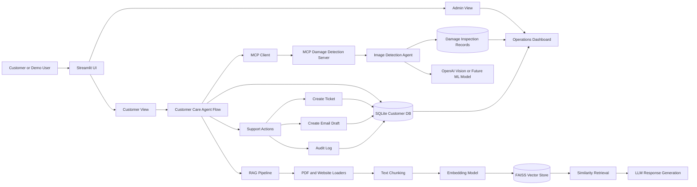

# LexiFlow Overall System Architecture

LexiFlow is a customer-care AI demo that combines RAG, customer database lookup,
tool execution, and MCP-based image inspection. The app is intentionally built
as a single Streamlit application for exhibition simplicity, while still showing
the same boundaries used in a production AI system.

## High-Level Architecture



## Runtime Flow

1. Business rules documents are uploaded through the sidebar.
2. The RAG pipeline parses, chunks, embeds, and stores document chunks in FAISS.
3. A customer is selected from the SQLite demo customer database.
4. The Customer Care Agent combines:
   - retrieved policy context from RAG,
   - customer/order context from SQLite,
   - image inspection context when available.
5. The agent answers the customer and may offer complaint creation.
6. If image proof is required, the app calls the MCP client.
7. The MCP client calls the local MCP server.
8. The MCP server invokes the Image Detection Agent.
9. The image inspection result is stored for admin review.
10. Tickets, email drafts, audit logs, and image inspections appear in Admin View.

## Deployment Shape

Current demo shape:

```text
One local Streamlit process
  app.py
    customer care flow
    SQLite access
    RAG pipeline
    MCP client subprocess call

One local MCP server subprocess per image inspection
  mcp_server.py
    inspect_product_damage tool
```

Production shape:

```text
Frontend app
  -> Customer agent service
  -> RAG service
  -> Customer/order database service
  -> Tool/MCP gateway
  -> Damage detection model service
  -> Ticketing/CRM/email APIs
```

## Main Components

| Component | File | Responsibility |
|---|---|---|
| Streamlit app | `app.py` | UI, customer/admin views, conversation state, action orchestration |
| RAG pipeline | `rag_pipeline.py` | PDF/web loading, chunking, embeddings, FAISS retrieval, LLM prompting |
| Customer database | `customer_db.py` | SQLite schema, sample customers/orders/tickets/drafts/audit/inspection records |
| Damage agent | `damage_detection_agent.py` | Product image inspection using OpenAI vision or mock fallback |
| MCP server | `mcp_server.py` | Exposes `inspect_product_damage` as an MCP-style stdio tool |
| MCP client | `mcp_client.py` | Calls the MCP server from the Streamlit app |
| MCP notes | `MCP_USAGE.md` | Minimal usage notes for the MCP damage detection server |

## Data Stores

| Store | Type | Purpose |
|---|---|---|
| FAISS vector DB | Local vector index | Stores embedded business rule chunks for retrieval |
| SQLite DB | Local relational DB | Stores customer/order/warranty/ticket/email/audit/inspection demo data |
| Uploads folder | Local files | Stores uploaded product images for inspection |

## Why This Architecture Works for a Demo

- It shows grounded AI responses through RAG.
- It shows customer-specific personalization through database lookup.
- It shows action execution through ticket and email draft creation.
- It shows MCP as a clean tool boundary for image inspection.
- It separates Customer View from Admin View for a realistic support workflow.
- It leaves a clear path to replace OpenAI vision with the trained ML damage model.
