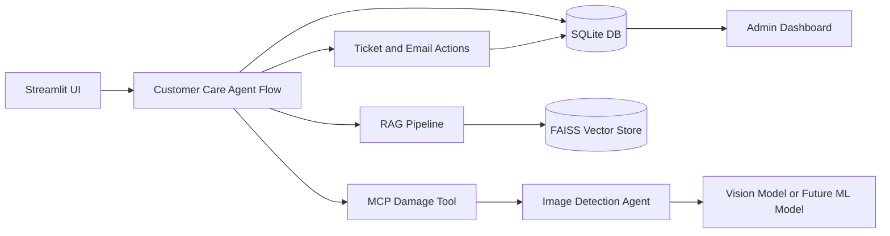

# LexiFlow Technical Audience Presentation

## Slide 1: Title

LexiFlow: MultiAgent Customer Care with RAG, MCP, and Image Inspection

Subtitle:

An AI support demo that combines business rules retrieval, customer database
context, support action automation, and MCP-based image inspection.

## Slide 2: Problem Statement

Customer support teams need answers that are:

- policy-aware,
- customer-specific,
- traceable to source documents,
- able to trigger support actions,
- able to validate product damage evidence.

Generic chatbots fail because they do not reliably know company policy,
customer order context, or real product condition.

## Slide 3: Solution Overview

LexiFlow provides a customer-care AI workflow:

- RAG retrieves business policy context.
- SQLite provides customer/order/warranty facts.
- Customer Care Agent answers and decides next steps.
- MCP invokes a specialist Image Detection Agent.
- Ticket and email draft actions are created after confirmation.
- Admin View tracks tickets and image inspection results.

## Slide 4: Demo User Experience

Customer View:

- active customer context,
- customer conversation,
- complaint confirmation buttons,
- image upload when evidence is required,
- ticket/email status messages.

Admin View:

- operations dashboard,
- ticket records,
- email drafts,
- audit logs,
- image inspection history,
- source search and document intelligence.

## Slide 5: Overall Architecture



## Slide 6: RAG Pipeline

RAG is used to ground answers in business rules.

Flow:

1. Upload business rules PDF.
2. Load and parse pages.
3. Chunk text with overlap.
4. Generate embeddings.
5. Store chunks in FAISS.
6. Retrieve relevant chunks for each customer question.
7. Answer using retrieved context and customer facts.

## Slide 7: Customer Context

Customer data comes from SQLite:

- customer identity,
- order ID,
- product name,
- serial number,
- delivery date,
- warranty status,
- refund window status,
- replacement window status,
- previous tickets,
- email drafts,
- audit logs.

The LLM receives this context together with retrieved policy chunks.

## Slide 8: Agent-Like Decision Flow

The Customer Care Agent flow:

1. Receives customer question.
2. Retrieves policy context through RAG.
3. Reads selected customer/order context.
4. Generates a customer-facing answer.
5. Detects if a complaint should be offered.
6. Requests confirmation through buttons.
7. Requests image proof when required.
8. Creates ticket and email draft after confirmation.

## Slide 9: MCP Usage

MCP is used for a focused specialist tool:

```text
inspect_product_damage
```

Why MCP here:

- clean boundary between customer agent and damage inspection,
- easy to replace OpenAI vision with trained ML model,
- demonstrates tool invocation architecture,
- avoids mixing image model logic into customer conversation logic.

## Slide 10: Image Detection Agent

The Image Detection Agent returns structured evidence:

- inspection status,
- damage detected,
- damage type,
- severity,
- confidence,
- human review requirement,
- recommendation,
- image path,
- notes,
- source and model.

This output is shown in the customer flow and persisted for admin review.

## Slide 11: Complaint and Email Automation

When the customer confirms:

- a complaint ticket is created,
- priority is inferred from issue type,
- an email draft is generated,
- audit log is recorded,
- dashboard updates automatically.

This shows the difference between a chatbot and an AI support workflow.

## Slide 12: Admin Dashboard

Admin View provides operational visibility:

- total tickets,
- open tickets,
- high-priority tickets,
- image inspections,
- human-review cases,
- ticket table,
- inspection table.

This gives the demo an enterprise-support feel.

## Slide 13: Technical Stack

| Layer | Technology |
|---|---|
| UI | Streamlit |
| RAG framework | LangChain |
| Vector store | FAISS |
| LLM | OpenAI Chat model or Ollama local model |
| Embeddings | OpenAI or HuggingFace local embeddings |
| Database | SQLite |
| Tool protocol | Local MCP-style JSON-RPC over stdio |
| Image inspection | OpenAI vision now, trained ML model later |

## Slide 14: Why This Is More Than Basic RAG

LexiFlow combines:

- document-grounded answers,
- customer-specific database facts,
- agent-style workflow,
- image inspection tool,
- MCP client/server boundary,
- support action creation,
- dashboard and auditability.

The result is a realistic AI support system, not just a document chatbot.

## Slide 15: Current Status

Completed:

- Customer View and Admin View.
- Business rules document upload.
- RAG answering with sources.
- Customer/order lookup.
- Complaint flow with buttons.
- Ticket and email draft creation.
- Image inspection through MCP.
- Dashboard for tickets and inspections.

Remaining:

- integrate trained product damage ML model.
- polish reset/demo seed behavior.
- add end-to-end automated demo tests.

## Slide 16: Future Roadmap

Next steps:

- Replace OpenAI vision/mock with trained damage model.
- Move logical agents into separate services if scale is required.
- Add real CRM/ticketing API integration.
- Add email send API integration.
- Add authentication and role-based access.
- Add observability and evaluation metrics.

## Slide 17: Demo Script

1. Load business rules PDF.
2. Select `ORD-1001`.
3. Ask: "My product is not working. What should I do?"
4. Show source-backed answer.
5. Click `Yes, Create Ticket`.
6. Upload product image for inspection.
7. Show Image Detection Agent output.
8. Create complaint.
9. Switch to Admin View.
10. Show ticket, email draft, audit log, and image inspection dashboard.

## Slide 18: Key Takeaway

LexiFlow demonstrates how modern AI applications combine:

```text
Knowledge through RAG
Facts through databases
Actions through tools
Specialist capabilities through MCP
Operational visibility through dashboards
```

This is the practical pattern behind production-grade AI agents.
